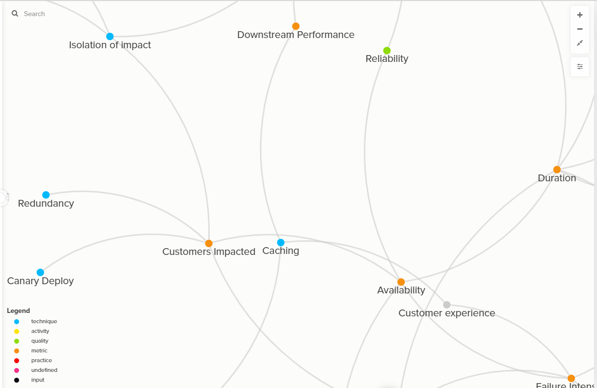

# Software Reliability Model - reliability-model

This Software Reliability Model (SRM) provides a flexible and explainable model of software reliability in terms of inputs, outputs, drivers, activities, and forces. It is designed to help explore and explain software reliability to people of various roles who are involved in building and running software systems (especially when on-boarding new team members), and track progress in improving reliability. The SRM is also designed to make it easy to generate and update hierarchical metrics for product health scores across multiple teams.

The software reliability model is designed to be relevant to several different kinds of software systems:

* internet and cloud-based software
* desktop software
* IoT and embedded software
* (combinations of the above)

The different inputs, outputs, drivers, activities, and forces are linked to create a graph that helps to explain the dynamics around software reliability. The graph is then visualised using the visualisation tool [Kumu](https://kumu.io/).

TODO: add screenshot of Kumu graph

## Audience

The SRM is aimed at these kinds of people:

* Product Owner / Product Manager
* [SRE](https://sre.google/) Manager / [SRE](https://sre.google/) Lead
* Software Architect / Systems Architect / Test Architect
* Software Developer
* Software Tester

The SRM helps these people to explore and discuss different aspects of software reliability to help make targeted improvements.

## What's in the SRM?

The SRM is composed of 2 main parts:

1. definitions of reliability factors in CSV format suitable for import to [Kumu](https://kumu.io/) 📄
2. graphs in [Kumu](https://kumu.io/) generated by importing the CSV definitions 📊

The CSV files are imported into Kumu to generate explorable graphs.

# Explore the latest version of the model on Kumu

Visit the latest stable version of the reliability model on Kumu: [https://kumu.io/reliability-model/latest](https://kumu.io/reliability-model/latest)

See all versions of the model: [https://kumu.io/reliability-model](https://kumu.io/reliability-model)

# Types of factors in the model

There are several types of factors in the SRM - each factor type is shown differently in the Kumu graph:

* activity - something that happens
* input - something enters the system
* metric - something measurable - a candidate for a [Service Level Indicator (SLI)](https://sre.google/sre-book/service-level-objectives/)
* output - something that exits the system
* pattern - a design or template that can be applied to different situations
* practice - something we do as professionals
* quality - an high-level aspect, attribute, or dimension of the software
* technique - a way of doing something, usually involving tools

## Tags to help explore the model

Tags are used to explore different dimensions of the model:

* 4 Key Metrics - from the book [_Accelerate_](https://itrevolution.com/book/accelerate/):
  - lead time
  - deployment frequency
  - Mean Time To Restore (MTTR)
  - Change failure rate
* design - something that shapes the design of the system
* external - something outside from the system
* internal - something inside the system
* tool - technology that provides a capability

# Notes on the model and visualization

1. Names of Kumu element types, connection types, and tags are ["selector friendly" for the Kumu advanced editor](https://docs.kumu.io/guides/import.html#try-to-be-selector-friendly) - a single word.
2. The graph layout visualization is controlled by the settings in the `*.css` view files (imported into the [Advanced Editor](https://docs.kumu.io/overview/view-editors.html#advanced-editor) settings in Kumu).

# Possible improvements

* Use CI to test Pull Requests against Kumu import:
  - Duplicate nodes?
  - Dangling connectors?
* Add flow efficiency / wait times?